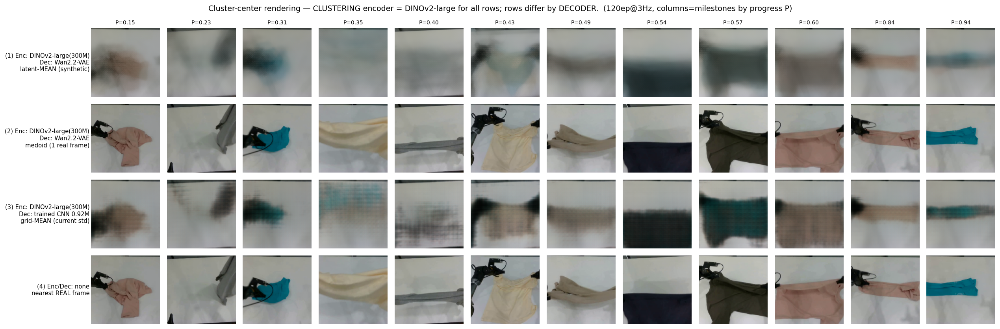
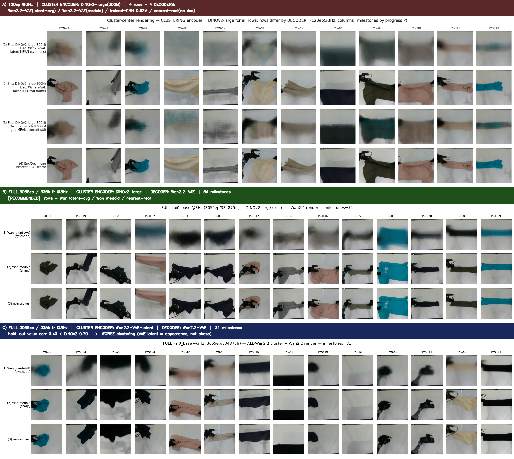
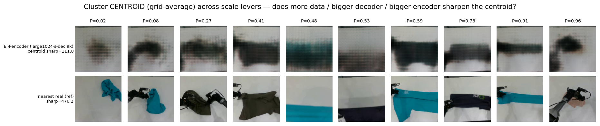
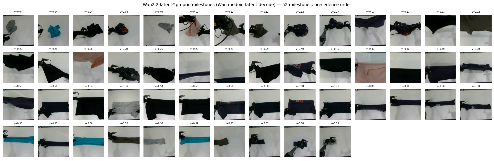

# 编码器(Encoders)：作用、选型与对比

> CRAVE 全程**零训练**,唯一的"表征"来自一个**冻结的视觉编码器**:帧 → 编码器 → 特征 →
> KMeans 聚类 → milestone 排序 → Viterbi-DP 读出 value。**编码器决定整条 pipeline 聚类
> 的特征空间**,是除数据质量外对 milestone/value 质量影响最大的单一旋钮。
>
> 编码器是**可插拔**的:注册表 [`crave/src/crave/config/encoders.py`](../src/crave/config/encoders.py)
> 是唯一事实源,加一个编码器 = 加一行 `EncoderSpec`,下游无需改动。运行时用
> `crave.encoders.load_encoder(name)`,产出 `encode_pooled (N,dim)` 与 `encode_grid (N,dim,16,16)`。
>
> 本文档配图统一放在 [`visualization/encoders/`](visualization/encoders/)。

---

## 1. 两类编码器各管什么

CRAVE 区分**语义**与**外观**两条互补的表征路:

| 路 | 编码器 | 抓什么 | 在 CRAVE 里的角色 |
|---|---|---|---|
| **语义 (semantic)** | DINOv2 / DINOv3 (ViT) | "**发生了什么 / 任务到哪一步**"——手-物关系、接触、相位 | **主力**:milestone 发现 + value 读出都跑在它的特征上 |
| **外观 (appearance)** | Wan2.2-VAE latent | "**画面长什么样**"——纹理、颜色、布料形态 | **辅助**:质心解码可读化 / 外观去歧义("3-path"中的一路) |

- **语义路**是 value 的来源:同任务多条 demo 反复出现的**语义状态** = 必经 milestone。DINO 的
  patch token 对"任务相位"高度敏感而对纹理相对不变,正是我们要的。
- **外观路**(Wan-VAE)**不参与 value**,主要用于把抽象 milestone 质心**解码回可看的图**,以及在
  语义近似但外观不同的状态间补充区分度。


*DINO 语义路:每个自动浮现的 milestone 质心(同一相位跨 episode 的代表帧)。*


*Wan-VAE 外观路:同样的质心在外观隐空间下的样子——纹理/形态保真,但相位区分度弱于 DINO。*


*语义特征(聚类用)与解码回像素(可读化用)是两件事:DINO 负责前者,空间解码器/Wan 负责后者。*

---

## 2. 注册表里的编码器

> 字段含义:`dim` 池化/逐 token 特征维;`dtype` 推理精度;`res` 处理分辨率(选成 patch 网格正好 16×16,
> 匹配固定 16→128 解码器);`nprefix` 池化前要跳过的前缀 token 数(CLS + register)。

### DINOv2(patch14 @224 → 16×16,nprefix=1,fp16)
| name | dim | 角色 |
|---|---|---|
| `dinov2-small` | 384 | **零训练 value 的历史默认**——最轻最快,milestone/value 已足够(kai0 GT MAE 0.105 即此档)。 |
| `dinov2-base`  | 768 | 中档,质心解码画廊更清晰。 |
| `dinov2-large` | 1024 | **质心代表图标准配置**(见 [centroid_representation_config](centroid_representation_config.md)):解码可读性最好。 |

DINOv2 只有 1 个前缀 token(CLS),无 register token,用 fp16 即可。



*规模消融:base→large 质心更锐、相位边界更干净;但对**最终 value 曲线**的提升远小于对**解码可读性**的提升——
value 早在 small 档就饱和,放大编码器主要买"图更好看",不是"value 更准"。*

### DINOv3(patch16 @256 → 16×16,nprefix=5,**bf16 必须**)
| name | dim | 状态 / 角色 |
|---|---|---|
| `dinov3-l`       | 1024 | **小号调试档**(ungated HF 格式镜像,~1.2GB)——比 H+ 轻、出图快,7B 下载期间先用它迭代。 |
| `dinov3-h`       | 1280 | **已验证**(ViT-H+,coffee 跨数据集 0→0.94)——当前最佳可用档。 |
| `dinov3-7b-int8` | 4096 | **旗舰**(int8 量化,bitsandbytes 加载)——特征最强,后台下载中。 |
| `dinov3-7b`      | 4096 | 旗舰全精度(占位,需 26.9GB,一般用 int8 即可)。 |

**DINOv3 vs DINOv2 的关键差异(实现必读)**:
1. **register token**:DINOv3 有 1 CLS + 4 register = **nprefix=5**,池化/reshape 前必须全部跳过,否则 16×16 网格错位。
2. **精度**:DINOv3 的 ViT-H+/7B 在 **fp16 会溢出成 NaN**,**必须 bf16**(int8 档内部也按 bf16 算)。详见 [[reference_dinov3_srpo_env]]。
3. **register token 让注意力更干净**(无 DINOv2 那种高范数伪影 patch),特征质量更高;代价是更大更慢、需更新的 transformers。


*DINOv3-H+ 在真实 ALOHA coffee 上自动浮现的 milestone 质心——跨本体零改配方。*


*同一编码器读出的单调 progress value(ep1,0→0.94),验证 DINOv3 路与既有 pipeline 完全对齐。*

### Wan2.2-VAE(外观隐空间)
| name | dim | 角色 |
|---|---|---|
| `wan-vae` | 48×16×16 | **外观路**:不做 value,做质心可读化解码 + 外观去歧义("3-path")。 |


*Wan-VAE 隐空间下的 milestone 外观——纹理/布料形态保真,适合"看",但相位语义不如 DINO。*

---

## 3. 怎么选

- **要复现 / 跑 value**:`dinov2-small`(最快)或 `dinov2-large`(出图最清)——零训练 value 早饱和,这两档够用。
- **要最强语义 / 跨本体泛化**:`dinov3-h`(已验证)→ `dinov3-7b-int8`(下完后,旗舰)。
- **7B 下载期间快速调试**:`dinov3-l`(小、drop-in)。
- **要把 milestone 质心解码成好看的图 / 外观去歧义**:加 `wan-vae` 走外观路。

```bash
# srpo 环境(torch2.10 + transformers4.57,DINOv3-capable)
/home/tim/miniconda3/envs/srpo/bin/python crave/scripts/generalize.py coffee --encoder dinov3-h
#                                                                              ^^^^^^^^^ 换 encoder 即换表征,pipeline 不变
```

> ⚠️ 经验:**换大编码器买到的多是"质心解码更清晰",不是"value 更准"**——value 质量的天花板更多由
> **数据质量**和 **Viterbi-DP 读出**决定(见 [METHOD](cross_episode_recurrence_value_METHOD.md) /
> [viterbi_computation](viterbi_computation.md)),编码器先从 small/large 起步、有需要再上 DINOv3。

---
**相关**:编码器注册表 [`config/encoders.py`](../src/crave/config/encoders.py) ·
DINOv3 环境与 7B 获取 [[reference_dinov3_srpo_env]] ·
质心解码标准配置 [centroid_representation_config](centroid_representation_config.md) ·
解码器规模消融 [milestone_centroid_decoding](milestone_centroid_decoding.md)
